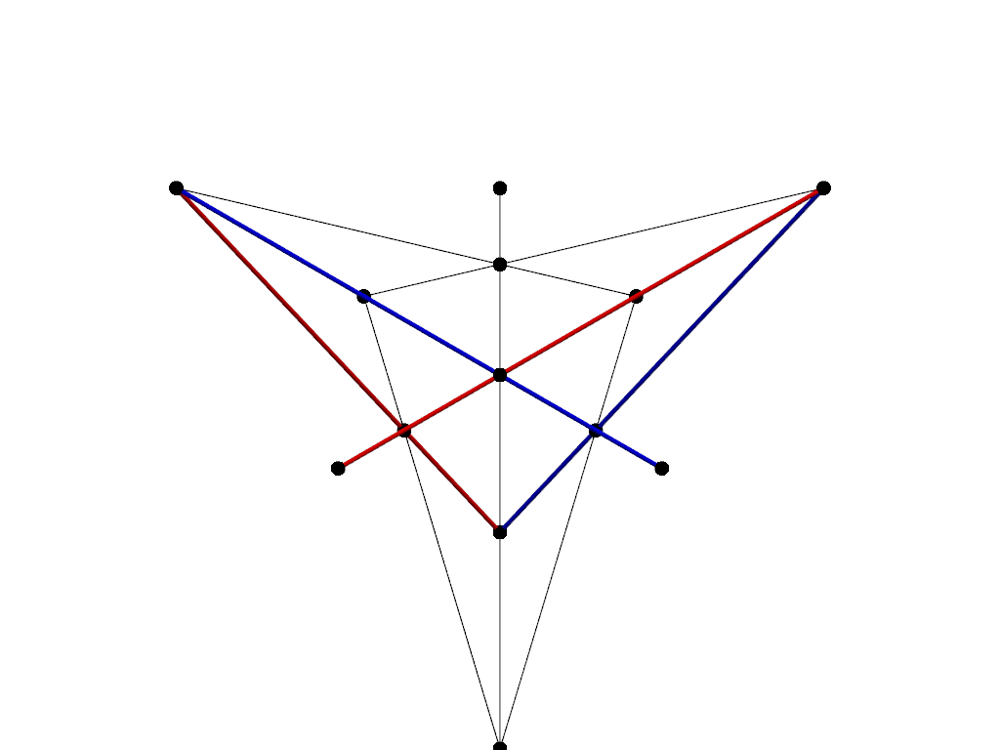

## Augmented magic square game scripts

Python scripts for the paper *Beyond the Magic Square Game: Widening the Gap for
Two Bell States* \[arXiv:[2603.20748](https://arxiv.org/abs/2603.20748)\].

* `ams_bit_sat.py` exhaustively determines the maximum number of augmented magic
square game equations satisfiable by a fixed bit assignment.

* `ams_strategy_checker.py` produces an optimal classical strategy for the
augmented magic square game (encoded as an integer). (WIP, will be modified to
produce optimal classical strategy for p-synchronous augmented magic square game
for any value of p.)

* `ams_viz.py` produces the animated gif above of the augmented magic square game
equations embedded in a rotating tetrahedron. Also shows the magic square game
equations as a substrucutre of the augmented magic square game with rows in red
and columns in blue.

Requires Python 3. `ams_strategy_checker.py` runs on CUDA and requires `numpy`,
`numba`, and `numba-cuda`. `ams_viz` requires `numpy` and `pyvista`.
